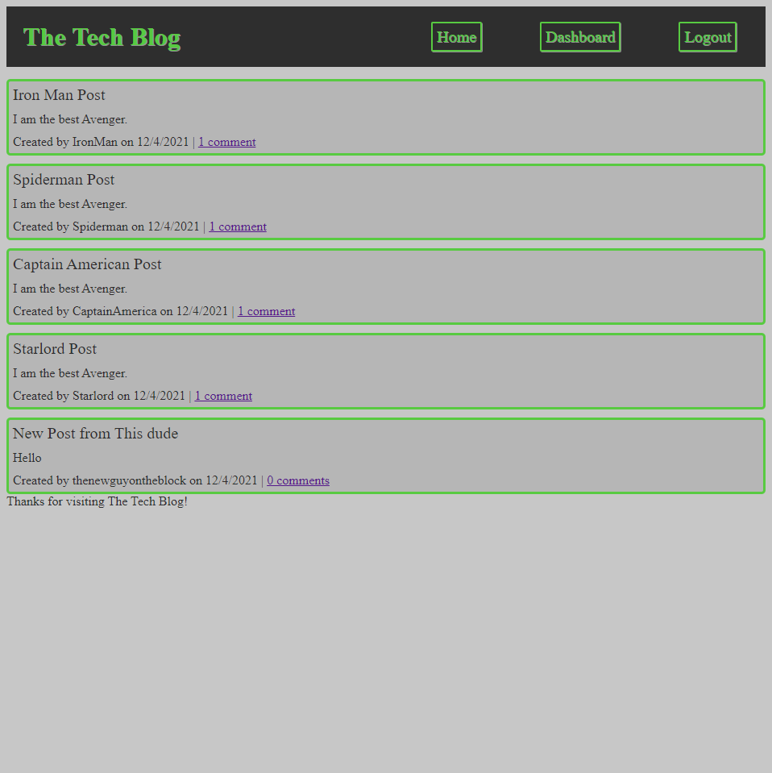

# The Tech Blog

Deployed Application: https://intense-lowlands-43802.herokuapp.com/

GitHub Repository: https://github.com/tniemeye19/mvc-tech-blog

## Table of Contents
* [Description](#description)
* [Screenshots](#screenshots)
* [Technologies](#technologies)
* [Questions](#questions)

## Description
The Tech Blog is a CMS style blog where users are able to publish their posts and comment on other users posts aswell. This app uses the Model View Controller paradigm as seen from the repository code.

## Screenshots
Landing Page

## Technologies
This application utilizes the following npm packages:
* bycrpt 
* connect-session-sequelize 
* dotenv 
* express 
* express-handlebars 
* express-session 
* mysql2 
* sequelize

This application is written with Handlebars.js and JavaScript, stylized with CSS, and utilizes MySQL to save user email addresses and passwords as well as the users blog posts and comments.

## Questions
Reach out to me using my [Github account](https://github.com/tniemeye19) or my [email](timothy.niemeyer19@gmail.com).